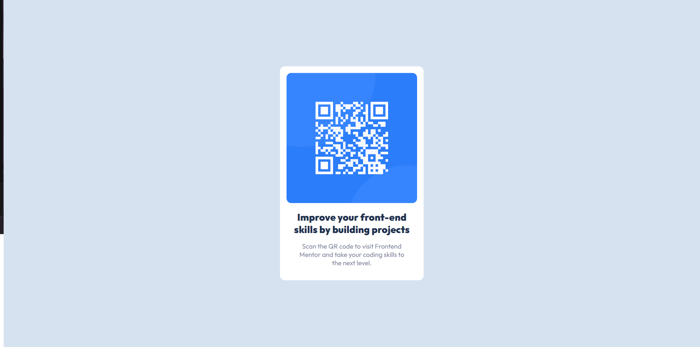

# Frontend Mentor - QR code component solution

This is a solution to the [QR code component challenge on Frontend Mentor](https://www.frontendmentor.io/challenges/qr-code-component-iux_sIO_H). Frontend Mentor challenges help you improve your coding skills by building realistic projects. 

## Table of contents

- [Overview](#overview)
  - [Screenshot](#screenshot)
  - [Links](#links)
  - [Built with](#built-with)
  - [What I learned](#what-i-learned)
  - [Continued development](#continued-development)
  - [Useful resources](#useful-resources)

## Overview

### Screenshot

### Links

- Solution URL: [Add solution URL here](https://your-solution-url.com)
- Live Site URL: [Add live site URL here](https://your-live-site-url.com)

### Built with

- HTML
- CSS

### What I learned

I was able to learn the many ways to center and div and was able to figure how to add custom fonts from Google's API.

### Continued development

I would like to focus on how to replicate the given design in a faster amount of time since it was the most time consuming part perfecting everything.

### Useful resources

- [W3Schools HTML](https://www.w3schools.com/html/) - This site helped refresh my memory for the basics of small HTML elements, definitely would recommend.

